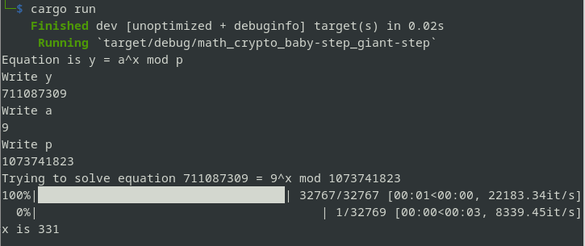

# rust-scripts
Small Rust scripts implementing some mathematical algorithms

## baby-step_giant-step
Implementation of [Baby-step_giant-step](https://en.wikipedia.org/wiki/Baby-step_giant-step) algorithm. This makes it easier to calculate the discrete logarithm.

#### To run:
```cmd
git clone https://github.com/userctf/rust-scripts.git
cd rust-scripts/baby-step_giant-step
cargo run
```

#### Example
we want to solve this equation
$711087309 = 9^x \mod 1073741823$ for x, just pass these three numbers into programm:
